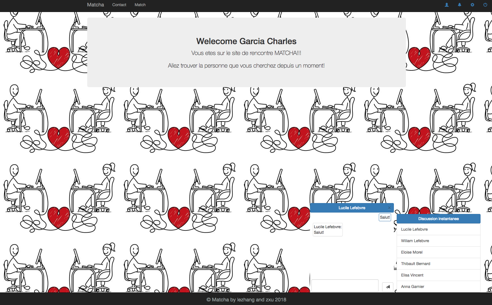
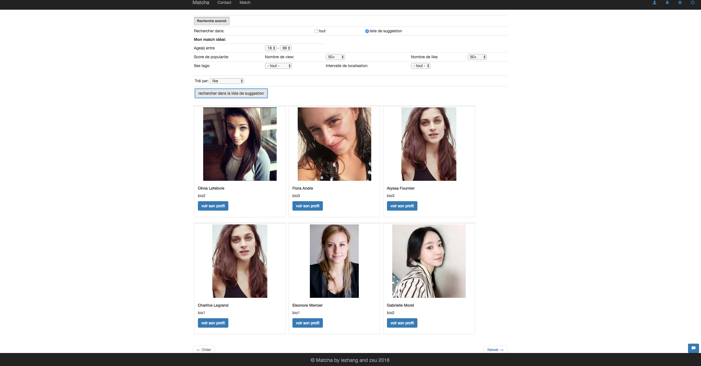
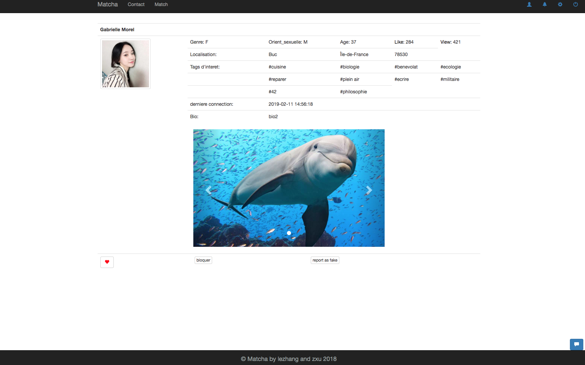

# Matcha

Matcha is a dating website 💘

### How to use it in local ?

 - Clone the project in server repertory (I use [MAMP](https://www.mamp.info/en/), so I clone the project in `mamp/apache2/htdocs`), call it `matcha`
 - Enter `localhost:8080/matcha/config/setup.php` to create database (your database username must be `root` and password must be `password`)
 - Go to the `config` repertory and run `python create_user.py` to create some virtual users.
 - Enter `localhost:8080/matcha/config/create_user.php` to save these users to the database.
 - Now you can use the site, the homepage is `localhost:8080/matcha`.

**Change the port 8080 if you don't use this port for the server.**

### Running

Create an account, and check your email to activate it. (If you use MAMP, check if you have active send mail function)
Connect to your account and start to match with someone! Or chat with others who already matched with you.

### Our stack

	* PHP Slim
	* HTML, CSS bootstrap
	* JavaScript
	* MySQL

### Author

Written by [lezhang](https://github.com/RiiceBall) and myself.
